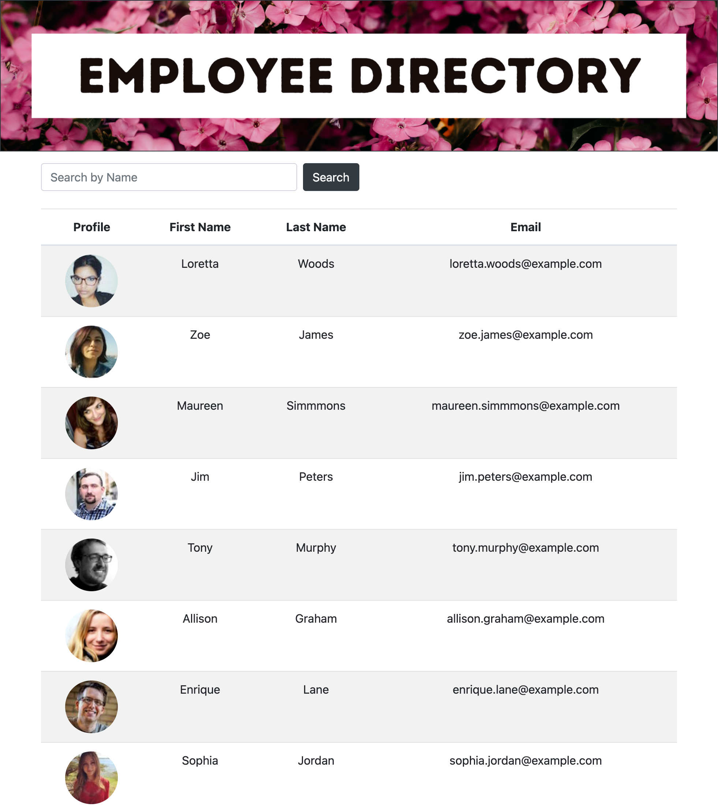

# Employee Directory
A REACT employee directory

## Description

A simple React application that displays an employee directory and allows users to search by name or sort the table alphabetically. User data has been pulled from the [Random User API](https://randomuser.me/).

## User Story

As a user, I want to be able to view my entire employee directory at once so that I have quick access to their information.

## Business Context

An employee or manager would benefit greatly from being able to view non-sensitive data about other employees. It would be particularly helpful to be able to filter employees by name.

## Table of Contents

* [Installation](#installation)
* [Usage](#usage)
* [Contributing Guidelines](#contributing)
* [License](#license)
* [Questions](#questions)

## Installation

This application was created using React and it's class based approach. It was deployed using GH pages and the deployed application can be viewed here: https://nidaqg.github.io/employee-directory/

## Usage

When the user navigates to the page they are presented with a table of employees listing names, emails and profile pictures.The user can view the table as is or search by name.The user can also click the first name or email header to sort the table alphabetically. 

## Contributing

 

 Link to Contributor's Covenant:[Contributors Covenant](https://www.contributor-covenant.org/version/2/0/code_of_conduct/) 

 
## License

   
Copyright (c) [2021] [Nida Ghuman]

Permission is hereby granted, free of charge, to any person obtaining a copy
of this software and associated documentation files (the "Software"), to deal
in the Software without restriction, including without limitation the rights
to use, copy, modify, merge, publish, distribute, sublicense, and/or sell
copies of the Software, and to permit persons to whom the Software is
furnished to do so, subject to the following conditions:

The above copyright notice and this permission notice shall be included in all
copies or substantial portions of the Software.

THE SOFTWARE IS PROVIDED "AS IS", WITHOUT WARRANTY OF ANY KIND, EXPRESS OR
IMPLIED, INCLUDING BUT NOT LIMITED TO THE WARRANTIES OF MERCHANTABILITY,
FITNESS FOR A PARTICULAR PURPOSE AND NONINFRINGEMENT. IN NO EVENT SHALL THE
AUTHORS OR COPYRIGHT HOLDERS BE LIABLE FOR ANY CLAIM, DAMAGES OR OTHER
LIABILITY, WHETHER IN AN ACTION OF CONTRACT, TORT OR OTHERWISE, ARISING FROM,
OUT OF OR IN CONNECTION WITH THE SOFTWARE OR THE USE OR OTHER DEALINGS IN THE
SOFTWARE. 

## Questions

The repo for this project can be found here: https://github.com/nidaqg/employee-directory

Deployed project can be found at: https://nidaqg.github.io/employee-directory/

For any questions or to report issues, email me at: nidaqg@gmail.com

